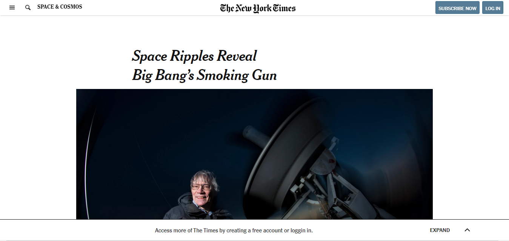

# NYT Page Clone

> This is an assigment for Microverse HTML and CSS course. The goal is to clone the NYT Page page with static functionability.

## Description

 This page is one of ours required projects on micreverse and the porpouse of it is to learn properly how to use grid, flexbox and float. That was a good project to work with, because the page was chosen for have a layout that will be very usual for us, when facing daily real projects that we'll have to chose which one use grid or flex? Now we know that it depends of the situation.

## Built With

- HTML,
- CSS,
- Visual Studio Code

## Live Demo

[Live Demo](https://raw.githack.com/Hermela-Fikre/NYT-article/NYT-Clone/index.html)

## Getting Started

To get a local copy up and running follow these simple example steps.

### Prerequisites

- A compatible browser with HTML and CSS. 

### Install

- Just clone the project

### Usage

- Open the index.html file in any browser or edit using Visual Code or the preference IDE for web development

## Authors

👤 **Hermela Fikre**

- Github: [@Hermela-Fikre](https://github.com/Hermela-Fikre)
- Twitter: [@Hermela86529600](https://twitter.com/Hermela86529600)
- Linkedin: [hermela-fikre](https://www.linkedin.com/in/hermela-fikre-1a969b156/)

👤 **Kevin Alves**

- Github: [@kevinalvesdev](https://github.com/Kevinalvesdev)
- Twitter: [@kevinnnmn](https://twitter.com/kevinnnmn)
- Linkedin: [@kevinnn](https://www.linkedin.com/in/kevinnn/)

## 🤝 Contributing

Contributions, issues and feature requests are welcome!

Feel free to check the [issues page](https://github.com/Hermela-Fikre/NYT-article/issues).

## Show your support

Give a ⭐️ if you like this project!

## Acknowledgments

- The Odin Project
- Youtube

## 📝 License

This project is free to use as learning purposes. For any external content (e.g. logo, images, ...), please contact the proper author and check their license of use.
